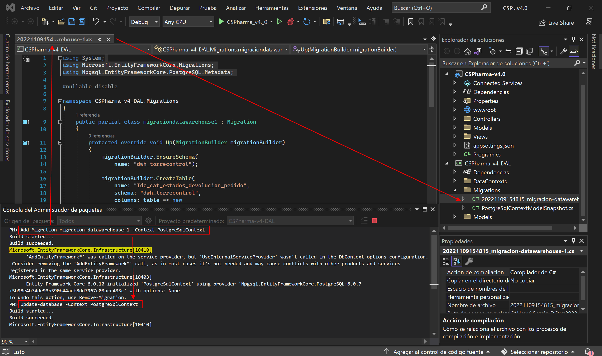
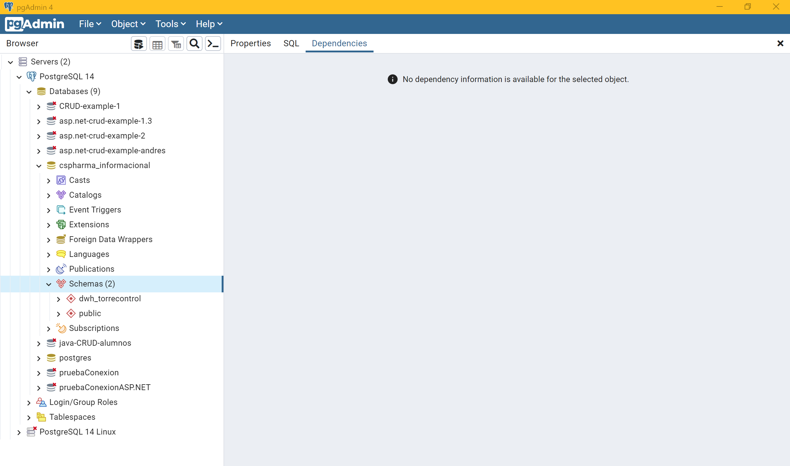
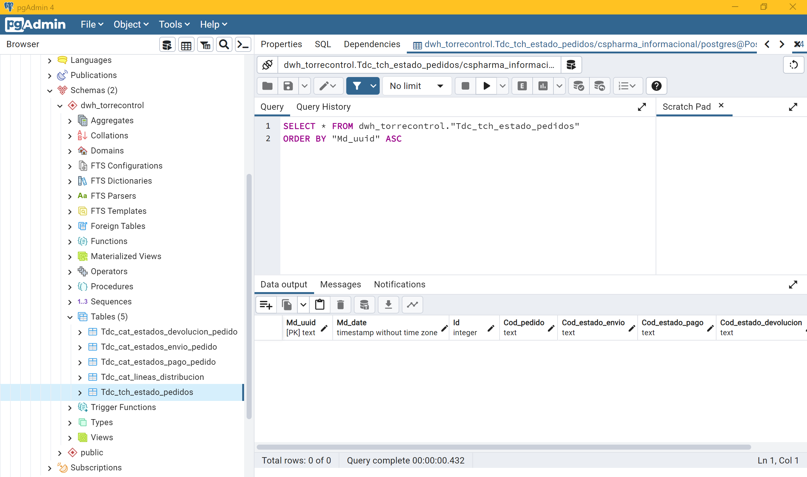
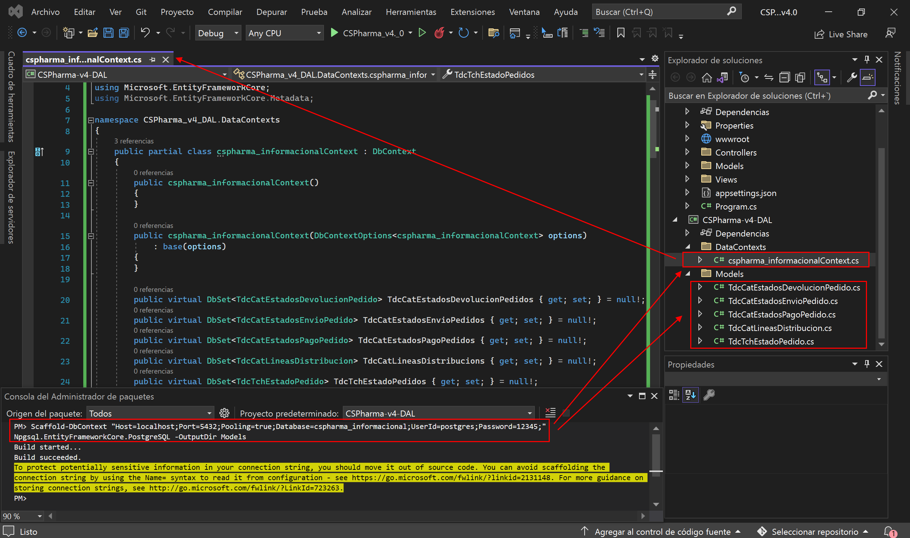

# Proyecto CSPharma-v4.0

- [Proyecto CSPharma-v4.0](#proyecto-cspharma-v40)
- [0. Introducción](#0-introducción)
  - [Base de Datos](#base-de-datos)
    - [tdc_tch_estado_pedidos](#tdc_tch_estado_pedidos)
    - [tdc_cat_lineas_distribucion](#tdc_cat_lineas_distribucion)
    - [tdc_cat_estados_envio_pedido](#tdc_cat_estados_envio_pedido)
    - [tdc_cat_estados_pago_pedido](#tdc_cat_estados_pago_pedido)
    - [tdc_cat_estados_devolucion_pedido](#tdc_cat_estados_devolucion_pedido)
- [1. Crear el proyecto](#1-crear-el-proyecto)
- [2. *DAL --> Models*](#2-dal----models)
  - [2.1. Estado_pedidos.cs](#21-estado_pedidoscs)
  - [2.2. Lineas_distribucion.cs](#22-lineas_distribucioncs)
  - [2.3. Estados_envio_pedido.cs](#23-estados_envio_pedidocs)
  - [2.5. Estados_pago_pedido.cs](#25-estados_pago_pedidocs)
  - [2.6. Estados_devolucion_pedido.cs](#26-estados_devolucion_pedidocs)
- [3. *DAL --> DataContexts --> PostgreSqlContext.cs*](#3-dal----datacontexts----postgresqlcontextcs)
- [4. Conexión con la BBDD](#4-conexión-con-la-bbdd)
  - [4.1. appsettings.json](#41-appsettingsjson)
  - [4.2. Program.cs](#42-programcs)
- [5. Migration](#5-migration)
  - [5.1. migracion-datawarehouse-1.cs](#51-migracion-datawarehouse-1cs)
  - [5.2. migracion-datawarehouse-1.Designer.cs](#52-migracion-datawarehouse-1designercs)
- [⚠️⚠️⚠️ Duda - Observación ⚠️⚠️⚠️](#️️️-duda---observación-️️️)
- [6. Database First](#6-database-first)
  - [6.1. Marcar como "nullables" las propiedades [ForeignKey] de la entidad relación](#61-marcar-como-nullables-las-propiedades-foreignkey-de-la-entidad-relación)
    - [TdcTchEstadoPedido.cs](#tdctchestadopedidocs)
    - [TdcCatLineasDistribucion.cs](#tdccatlineasdistribucioncs)
    - [TdcCatEstadosEnvioPedido.cs](#tdccatestadosenviopedidocs)
    - [TdcCatEstadosPagoPedido.cs](#tdccatestadospagopedidocs)
    - [TdcCatEstadosDevolucionPedido.cs](#tdccatestadosdevolucionpedidocs)
- [7. Controladores](#7-controladores)
- [8. Enrutamos las vistas en el navbar](#8-enrutamos-las-vistas-en-el-navbar)
- [9. Ejecución del programa](#9-ejecución-del-programa)
  - [9.1. Antes de ejecutarlo, no te olvides de volver a poner el el servicio de conexión con el nuevo DbContext](#91-antes-de-ejecutarlo-no-te-olvides-de-volver-a-poner-el-el-servicio-de-conexión-con-el-nuevo-dbcontext)
  - [9.2. Video ejemplo de la ejecución](#92-video-ejemplo-de-la-ejecución)

# 0. Introducción

CSPharma, distribuidora farmacéutica líder a nivel nacional quiere generar una nueva aplicación web para gestionar el ciclo de vida de los pedidos que recibe. Este proyecto se enmarca dentro de la propuesta Pharma 4.0 llevada a cabo por el departamento de innovación, cuyo fin es la modernización de todos los sistemas y aplicativos de la compañía.

El primer paso para esto, será la generación de una nueva base de datos con la especificación que se detalla a continuación y asegurar la capacidad del software para leer, insertar, borrar y actualizar registros.

## Base de Datos

Nuestro sistema tendrá dos bases de datos “cspharma_operacional” y “cspharma_informacional”. En la primera se recibirán los datos brutos de los pedidos que se han realizado a CSPharma y en la segunda, estará disponible la información de estos pedidos tras el procesamiento de los datos del sistema operacional.

Por ahora, dejemos a un lado la aplicación web desde la que se podrán realizar los pedidos y centrémonos en la aplicación que nos permitirá controlar el ciclo de vida de estos: Torre de control.

Nuestra base de datos “cspharma_informacional” estará dividida en tres esquemas: “dlk_informacional”, “dwh_torrecontrol” y “dmt_torrecontrol”.

- dlk_informacional: contiene los datos brutos recibidos de la base de datos dispharma_operacional.

- dwh_torrecontrol: contiene la información obtenida tras el procesamiento de los datos brutos del esquema dlk_informacional.

- dmt_torrecontrol: contiene las vistas que se ofrecerán al usuario (persona o aplicación) para consultar la información.

A pesar de tener que construir toda la estructura de la base de datos “cspharma_informacional” en un inicio, el proyecto se centrará en el esquema dwh_torrecontrol.

“dwh_torrecontrol” contendrá la siguiente información:

### tdc_tch_estado_pedidos

| Nombre Campo | Permite Nulo | Tipo | Descripcion |
--- | --- | --- | ---
| md_uuid | NO | alfanumérico | Código de metadato que indica el grupo de inserción al que pertenece el registro. |
| md_date | NO | timestamp sin huso horario | Fecha en la que se define el grupo de inserción. |
| id | NO | autonumérico | Identificador unívoco del pedido en el sistema. |
| cod_estado_envio |  | alfanumérico | Código que identifica de forma unívoca el estado de envío de un pedido. |
| cod_estado_pago |  | alfanumérico | Código que identifica de forma unívoca el estado de pago de un pedido. |
| cod_estado_devolucion |  | alfanumérico | Código que identifica de forma unívoca el estado de devolución de un pedido. |
| cod_pedido | NO | alfanumérico | Código que identifica de forma unívoca un pedido. Se construye con: provincia-codfarmacia-id. |
| cod_linea | NO | alfanumérico | Código que identifica de forma unívoca la línea de distribución por carretera que sigue el envío: codprovincia-codmunicipio-codbarrio. |

El id de un pedido debe mantenerse durante todo el ciclo de vida de un pedido, desde su entrada en el operacional.

### tdc_cat_lineas_distribucion

| Nombre Campo | Permite Nulo | Tipo | Descripcion |
--- | --- | --- | ---
| md_uuid | NO | alfanumérico | Código de metadato que indica el grupo de inserción al que pertenece el registro. |
| md_date | NO | timestamp sin huso horario | Fecha en la que se define el grupo de inserción. |
| id | NO | autonumérico | Identificador unívoco de la línea de distribución en el sistema. |
| cod_linea | NO | alfanumérico | Código que identifica de forma unívoca la línea de distribución por carretera que sigue el envío: codprovincia-codmunicipio-codbarrio. |
| cod_provincia | NO | alfanumérico | Código que identifica de forma unívoca a la provincia. |
| cod_municipio | NO | alfanumérico | Código que identifica de forma unívoca el municipio. |
| cod_barrio | NO | alfanumérico | Código que identifica de forma unívoca el barrio. |

Empezaremos trabajando sólo con dos líneas: SEV-SEV-AMA y SEV-SEV-NER.

### tdc_cat_estados_envio_pedido

| Nombre Campo | Permite Nulo | Tipo | Descripcion |
--- | --- | --- | ---
| md_uuid | NO | alfanumérico | Código de metadato que indica el grupo de inserción al que pertenece el registro. |
| md_date | NO | timestamp sin huso horario | Fecha en la que se define el grupo de inserción. |
| id | NO | autonumérico | Identificador unívoco del estado de envío del pedido en el sistema. |
| cod_estado_envio | NO | alfanumérico | Código que identifica de forma unívoca el estado de envío de un pedido. |
| des_estado_envio |  | alfanumérico | Descripción del estado de envío del pedido. |

Se empezará a trabajar con los siguientes estados: S1 (Solicitado), R1 (Registrado en almacén), P1 (En preparación), E1 (Enviado completo), E2 (Enviado parcial), D (Devuelto), R (Recibido en farmacia)

### tdc_cat_estados_pago_pedido

| Nombre Campo | Permite Nulo | Tipo | Descripcion |
--- | --- | --- | ---
| md_uuid | NO | alfanumérico | Código de metadato que indica el grupo de inserción al que pertenece el registro. |
| md_date | NO | timestamp sin huso horario | Fecha en la que se define el grupo de inserción. |
| id | NO | autonumérico | Identificador unívoco del estado de pago del pedido en el sistema. |
| cod_estado_pago | NO | alfanumérico | Código que identifica de forma unívoca el estado de pago de un pedido. |
| des_estado_pago |  | alfanumérico | Descripción del estado de pago del pedido. |

Se empezará a trabajar con los siguientes estados: E1 (Emitida factura), P (Pagado), P2 (Pago fraccionado), R (Rechazado), D1 (Emisión cancelación), D2 (Pago devuelto)

### tdc_cat_estados_devolucion_pedido

| Nombre Campo | Permite Nulo | Tipo | Descripcion |
--- | --- | --- | ---
| md_uuid | NO | alfanumérico | Código de metadato que indica el grupo de inserción al que pertenece el registro. |
| md_date | NO | timestamp sin huso horario | Fecha en la que se define el grupo de inserción. |
| id | NO | autonumérico | Identificador unívoco del estado de devolución del pedido en el sistema. |
| cod_estado_devolucion | NO | alfanumérico | Código que identifica de forma unívoca el estado de devolución de un pedido. |
| des_estado_devolucion |  | alfanumérico | Descripción del estado de devolución del pedido. |

Se empezará a trabajar con los siguientes estados: A (Aceptada), R (Rechazada), D1 (Devolución en almacén), D2 (Devolución finalizada)

# 1. Crear el proyecto

Creamos un proyecto de tipo Aplicación Web de ASP.NET Core (Modelo-Vista-Controlador), y dentro de éste (clickando en la solución) le agregamos otro nuevo proyecto de tipo Biblioteca de Clases (.NET standar, y la llamamos *DAL*), y una vez tengamos los dos proyectos, tan sólo tenemos que referenciar el principal con el proyecto de la capa DAL (clickando en el *.csproj* del proyecto principal).

# 2. *DAL --> Models*

## 2.1. Estado_pedidos.cs

```csharp
using System;
using System.Collections.Generic;
using System.ComponentModel.DataAnnotations;
using System.ComponentModel.DataAnnotations.Schema;
using System.Linq;
using System.Text;
using System.Threading.Tasks;
using System.Xml.Linq;

namespace CSPharma_v4_DAL.Models
{
    [Table("Tdc_tch_estado_pedidos", Schema = "dwh_torrecontrol")]
    public class Estado_pedidos
    {
        [Required]
        [Column("Md_uuid")]
        [Display(Name = "Md_uuid")]
        public string Md_uuid { get; set; }
        
        [Required]
        [Column("Md_date")]
        [Display(Name = "Md_date")]
        public DateTime Md_date { get; set; }

        [Key]
        [Column("Id")]
        [Display(Name = "Id")]
        [DatabaseGenerated(DatabaseGeneratedOption.Identity)]
        public int Id { get; set; }

        [Required]
        [Column("Cod_pedido")]
        [Display(Name = "Cod_pedido")]
        public string Cod_pedido { get; set; }

        // [Required]
        [Column("Cod_estado_envio")]
        [Display(Name = "Cod_estado_envio")]
        public string? Cod_estado_envio { get; set; }

        // [Required]
        [Column("Cod_estado_pago")]
        [Display(Name = "Cod_estado_pago")]
        public string? Cod_estado_pago { get; set; }

        // [Required]
        [Column("Cod_estado_devolucion")]
        [Display(Name = "Cod_estado_devolucion")]
        public string? Cod_estado_devolucion { get; set; }

        [Required]
        [Column("Cod_linea")]
        [Display(Name = "Cod_linea")]
        public string Cod_linea { get; set; }

        /***************************************************************************************/

        [ForeignKey("Cod_linea")]
        public virtual Lineas_distribucion? LineaDistribucion { get; set; }

        [ForeignKey("Cod_estado_envio")]
        public virtual Estados_envio_pedido? EstadoEnvio { get; set; }

        [ForeignKey("Cod_estado_pago")]
        public virtual Estados_pago_pedido? EstadoPago { get; set; }

        [ForeignKey("Cod_estado_devolucion")]
        public virtual Estados_devolucion_pedido? EstadoDevolucion { get; set; }
    }
}
```

## 2.2. Lineas_distribucion.cs

```csharp
using System;
using System.Collections.Generic;
using System.ComponentModel.DataAnnotations.Schema;
using System.ComponentModel.DataAnnotations;
using System.Linq;
using System.Text;
using System.Threading.Tasks;
using System.Xml.Linq;

namespace CSPharma_v4_DAL.Models
{
    [Table("Tdc_cat_lineas_distribucion", Schema = "dwh_torrecontrol")]
    public class Lineas_distribucion
    {
        [Required]
        [Column("Md_uuid")]
        [Display(Name = "Md_uuid")]
        public string Md_uuid { get; set; }

        [Required]
        [Column("Md_date")]
        [Display(Name = "Md_date")]
        public DateTime Md_date { get; set; }

        // [Required]
        [Column("Id")]
        [Display(Name = "Id")]
        [DatabaseGenerated(DatabaseGeneratedOption.Identity)]
        public int Id { get; set; }

        [Key]
        [Column("Cod_linea")]
        [Display(Name = "Cod_linea")]
        public string Cod_linea { get; set; }

        [Required]
        [Column("Cod_provincia")]
        [Display(Name = "Cod_provincia")]
        public string Cod_provincia { get; set; }

        [Required]
        [Column("Cod_municipio")]
        [Display(Name = "Cod_municipio")]
        public string Cod_municipio { get; set; }

        [Required]
        [Column("Cod_barrio")]
        [Display(Name = "Cod_barrio")]
        public string Cod_barrio { get; set; }

        /***************************************************************************************************/

        [InverseProperty("LineaDistribucion")]
        public virtual List<Estado_pedidos>? ListaEstadoPedidos { get; set; }
    }
}
```

## 2.3. Estados_envio_pedido.cs

```csharp
using System;
using System.Collections.Generic;
using System.ComponentModel.DataAnnotations;
using System.ComponentModel.DataAnnotations.Schema;
using System.Linq;
using System.Text;
using System.Threading.Tasks;
using System.Xml.Linq;

namespace CSPharma_v4_DAL.Models
{
    [Table("Tdc_cat_estados_envio_pedido", Schema = "dwh_torrecontrol")]
    public class Estados_envio_pedido
    {
        [Required]
        [Column("Md_uuid")]
        [Display(Name = "Md_uuid")]
        public string Md_uuid { get; set; }

        [Required]
        [Column("Md_date")]
        [Display(Name = "Md_date")]
        public DateTime Md_date { get; set; }

        // [Required]
        [Column("Id")]
        [Display(Name = "Id")]
        [DatabaseGenerated(DatabaseGeneratedOption.Identity)]
        public int Id { get; set; }

        [Key]
        [Column("Cod_estado_envio")]
        [Display(Name = "Cod_estado_envio")]
        public string Cod_estado_envio { get; set; }

        // [Required]
        [Column("Des_estado_envio")]
        [Display(Name = "Des_estado_envio")]
        public string? Des_estado_envio { get; set; }

        /***************************************************************************************************/

        [InverseProperty("EstadoEnvio")]
        public virtual List<Estado_pedidos>? ListaEstadoPedidos { get; set; }
    }
}
```

## 2.5. Estados_pago_pedido.cs

```csharp
using System;
using System.Collections.Generic;
using System.ComponentModel.DataAnnotations;
using System.ComponentModel.DataAnnotations.Schema;
using System.Linq;
using System.Text;
using System.Threading.Tasks;
using System.Xml.Linq;

namespace CSPharma_v4_DAL.Models
{
    [Table("Tdc_cat_estados_pago_pedido", Schema = "dwh_torrecontrol")]
    public class Estados_pago_pedido
    {
        [Required]
        [Column("Md_uuid")]
        [Display(Name = "Md_uuid")]
        public string Md_uuid { get; set; }

        [Required]
        [Column("Md_date")]
        [Display(Name = "Md_date")]
        public DateTime Md_date { get; set; }

        // [Required]
        [Column("Id")]
        [Display(Name = "Id")]
        [DatabaseGenerated(DatabaseGeneratedOption.Identity)]
        public int Id { get; set; }

        [Key]
        [Column("Cod_estado_pago")]
        [Display(Name = "Cod_estado_pago")]
        public string Cod_estado_pago { get; set; }

        // [Required]
        [Column("Des_estado_pago")]
        [Display(Name = "Des_estado_pago")]
        public string? Des_estado_pago { get; set; }

        /***************************************************************************************************/

        [InverseProperty("EstadoPago")]
        public virtual List<Estado_pedidos>? ListaEstadoPedidos { get; set; }
    }
}
```

## 2.6. Estados_devolucion_pedido.cs

```csharp
using System;
using System.Collections.Generic;
using System.ComponentModel.DataAnnotations;
using System.ComponentModel.DataAnnotations.Schema;
using System.Linq;
using System.Text;
using System.Threading.Tasks;
using System.Xml.Linq;

namespace CSPharma_v4_DAL.Models
{
    [Table("Tdc_cat_estados_devolucion_pedido", Schema = "dwh_torrecontrol")]
    public class Estados_devolucion_pedido
    {
        [Required]
        [Column("Md_uuid")]
        [Display(Name = "Md_uuid")]
        public string Md_uuid { get; set; }

        [Required]
        [Column("Md_date")]
        [Display(Name = "Md_date")]
        public DateTime Md_date { get; set; }

        // [Required]
        [Column("Id")]
        [Display(Name = "Id")]
        [DatabaseGenerated(DatabaseGeneratedOption.Identity)]
        public int Id { get; set; }

        [Key]
        [Column("Cod_estado_devolucion")]
        [Display(Name = "Cod_estado_devolucion")]
        public string Cod_estado_devolucion { get; set; }

        // [Required]
        [Column("Des_estado_devolucion")]
        [Display(Name = "Des_estado_devolucion")]
        public string? Des_estado_devolucion { get; set; }

        /***************************************************************************************************/

        [InverseProperty("EstadoDevolucion")]
        public virtual List<Estado_pedidos>? ListaEstadoPedidos { get; set; }
    }
}
```

# 3. *DAL --> DataContexts --> PostgreSqlContext.cs*

```csharp
using CSPharma_v4_DAL.Models;
using Microsoft.EntityFrameworkCore;
using System;
using System.Collections.Generic;
using System.Linq;
using System.Text;
using System.Threading.Tasks;

namespace CSPharma_v4_DAL.DataContexts
{
    public class PostgreSqlContext : DbContext
    {
        public PostgreSqlContext(DbContextOptions<PostgreSqlContext> options)
            : base(options)
        { }

        protected override void OnModelCreating(ModelBuilder modelBuilder)
        {
            modelBuilder.UseSerialColumns();
        }

        public DbSet<Estado_pedidos> SetEstadoPedidos { get; set; }
        public DbSet<Lineas_distribucion> SetLineasDistribucion { get; set; }
        public DbSet<Estados_envio_pedido> SetEstadosEnvioPedido { get; set; }
        public DbSet<Estados_pago_pedido> SetEstadosPagoPedido { get; set; }
        public DbSet<Estados_devolucion_pedido> SetEstadosDevolucionPedido { get; set; }
    }
}
```

# 4. Conexión con la BBDD

## 4.1. appsettings.json

```json
"AllowedHosts": "*",
  "ConnectionStrings": {
    "PostgreSqlConnection": "Host=localhost;Port=5432;Pooling=true;Database=cspharma_informacional;UserId=postgres;Password=12345;"
  }
```

## 4.2. Program.cs

```csharp
using CSPharma_v4_DAL.DataContexts;
using Microsoft.EntityFrameworkCore;

var builder = WebApplication.CreateBuilder(args);

// Add services to the container.
builder.Services.AddControllersWithViews();

// Añadimos nuestra conexión a la BBDD de PostgreSQL
builder.Services.AddEntityFrameworkNpgsql()
    .AddDbContext<PostgreSqlContext>(options =>
    {
        options.UseNpgsql(builder.Configuration.GetConnectionString("PostgreSqlConnection"));
    });

AppContext.SetSwitch("Npgsql.EnableLegacyTimestampBehavior", true); // para evitar posibles errores en la vista Create por el Datetime
```

# 5. Migration

Creamos una migración de nuestras clases modelos y nuestro DbContext hacia nuestra BBDD con el comando:

`Add-Migration migracion-datawarehouse-1 -Context PostgreSqlContext`

Y para llevar llevar efectivamente la definición de la BBDD a pgAdmin (y crear realmente la BBDD), necesitamos ejecutar el siguiente comando:

`Update-database -Context PostgreSqlContext`

**Nota**: estos comandos deben ser ejecutados en la consola administradora NuGet y desde el proyecto de la capa DAL.







## 5.1. migracion-datawarehouse-1.cs

```csharp
using System;
using Microsoft.EntityFrameworkCore.Migrations;
using Npgsql.EntityFrameworkCore.PostgreSQL.Metadata;

#nullable disable

namespace CSPharma_v4_DAL.Migrations
{
    public partial class migraciondatawarehouse1 : Migration
    {
        protected override void Up(MigrationBuilder migrationBuilder)
        {
            migrationBuilder.EnsureSchema(
                name: "dwh_torrecontrol");

            migrationBuilder.CreateTable(
                name: "Tdc_cat_estados_devolucion_pedido",
                schema: "dwh_torrecontrol",
                columns: table => new
                {
                    Md_uuid = table.Column<string>(type: "text", nullable: false),
                    Md_date = table.Column<DateTime>(type: "timestamp without time zone", nullable: false),
                    Id = table.Column<int>(type: "integer", nullable: false)
                        .Annotation("Npgsql:ValueGenerationStrategy", NpgsqlValueGenerationStrategy.SerialColumn),
                    Cod_estado_devolucion = table.Column<string>(type: "text", nullable: false),
                    Des_estado_devolucion = table.Column<string>(type: "text", nullable: true)
                },
                constraints: table =>
                {
                    table.PrimaryKey("PK_Tdc_cat_estados_devolucion_pedido", x => x.Md_uuid);
                });

            migrationBuilder.CreateTable(
                name: "Tdc_cat_estados_envio_pedido",
                schema: "dwh_torrecontrol",
                columns: table => new
                {
                    Md_uuid = table.Column<string>(type: "text", nullable: false),
                    Md_date = table.Column<DateTime>(type: "timestamp without time zone", nullable: false),
                    Id = table.Column<int>(type: "integer", nullable: false)
                        .Annotation("Npgsql:ValueGenerationStrategy", NpgsqlValueGenerationStrategy.SerialColumn),
                    Cod_estado_envio = table.Column<string>(type: "text", nullable: false),
                    Des_estado_envio = table.Column<string>(type: "text", nullable: true)
                },
                constraints: table =>
                {
                    table.PrimaryKey("PK_Tdc_cat_estados_envio_pedido", x => x.Md_uuid);
                });

            migrationBuilder.CreateTable(
                name: "Tdc_cat_estados_pago_pedido",
                schema: "dwh_torrecontrol",
                columns: table => new
                {
                    Md_uuid = table.Column<string>(type: "text", nullable: false),
                    Md_date = table.Column<DateTime>(type: "timestamp without time zone", nullable: false),
                    Id = table.Column<int>(type: "integer", nullable: false)
                        .Annotation("Npgsql:ValueGenerationStrategy", NpgsqlValueGenerationStrategy.SerialColumn),
                    Cod_estado_pago = table.Column<string>(type: "text", nullable: false),
                    Des_estado_pago = table.Column<string>(type: "text", nullable: true)
                },
                constraints: table =>
                {
                    table.PrimaryKey("PK_Tdc_cat_estados_pago_pedido", x => x.Md_uuid);
                });

            migrationBuilder.CreateTable(
                name: "Tdc_cat_lineas_distribucion",
                schema: "dwh_torrecontrol",
                columns: table => new
                {
                    Md_uuid = table.Column<string>(type: "text", nullable: false),
                    Md_date = table.Column<DateTime>(type: "timestamp without time zone", nullable: false),
                    Id = table.Column<int>(type: "integer", nullable: false)
                        .Annotation("Npgsql:ValueGenerationStrategy", NpgsqlValueGenerationStrategy.SerialColumn),
                    Cod_linea = table.Column<string>(type: "text", nullable: false),
                    Cod_provincia = table.Column<string>(type: "text", nullable: false),
                    Cod_municipio = table.Column<string>(type: "text", nullable: false),
                    Cod_barrio = table.Column<string>(type: "text", nullable: false)
                },
                constraints: table =>
                {
                    table.PrimaryKey("PK_Tdc_cat_lineas_distribucion", x => x.Md_uuid);
                });

            migrationBuilder.CreateTable(
                name: "Tdc_tch_estado_pedidos",
                schema: "dwh_torrecontrol",
                columns: table => new
                {
                    Md_uuid = table.Column<string>(type: "text", nullable: false),
                    Md_date = table.Column<DateTime>(type: "timestamp without time zone", nullable: false),
                    Id = table.Column<int>(type: "integer", nullable: false)
                        .Annotation("Npgsql:ValueGenerationStrategy", NpgsqlValueGenerationStrategy.SerialColumn),
                    Cod_pedido = table.Column<string>(type: "text", nullable: false),
                    Cod_estado_envio = table.Column<string>(type: "text", nullable: true),
                    Cod_estado_pago = table.Column<string>(type: "text", nullable: true),
                    Cod_estado_devolucion = table.Column<string>(type: "text", nullable: true),
                    Cod_linea = table.Column<string>(type: "text", nullable: false)
                },
                constraints: table =>
                {
                    table.PrimaryKey("PK_Tdc_tch_estado_pedidos", x => x.Md_uuid);
                    table.ForeignKey(
                        name: "FK_Tdc_tch_estado_pedidos_Tdc_cat_estados_devolucion_pedido_Co~",
                        column: x => x.Cod_estado_devolucion,
                        principalSchema: "dwh_torrecontrol",
                        principalTable: "Tdc_cat_estados_devolucion_pedido",
                        principalColumn: "Md_uuid");
                    table.ForeignKey(
                        name: "FK_Tdc_tch_estado_pedidos_Tdc_cat_estados_envio_pedido_Cod_est~",
                        column: x => x.Cod_estado_envio,
                        principalSchema: "dwh_torrecontrol",
                        principalTable: "Tdc_cat_estados_envio_pedido",
                        principalColumn: "Md_uuid");
                    table.ForeignKey(
                        name: "FK_Tdc_tch_estado_pedidos_Tdc_cat_estados_pago_pedido_Cod_esta~",
                        column: x => x.Cod_estado_pago,
                        principalSchema: "dwh_torrecontrol",
                        principalTable: "Tdc_cat_estados_pago_pedido",
                        principalColumn: "Md_uuid");
                    table.ForeignKey(
                        name: "FK_Tdc_tch_estado_pedidos_Tdc_cat_lineas_distribucion_Cod_linea",
                        column: x => x.Cod_linea,
                        principalSchema: "dwh_torrecontrol",
                        principalTable: "Tdc_cat_lineas_distribucion",
                        principalColumn: "Md_uuid",
                        onDelete: ReferentialAction.Cascade);
                });

            migrationBuilder.CreateIndex(
                name: "IX_Tdc_tch_estado_pedidos_Cod_estado_devolucion",
                schema: "dwh_torrecontrol",
                table: "Tdc_tch_estado_pedidos",
                column: "Cod_estado_devolucion");

            migrationBuilder.CreateIndex(
                name: "IX_Tdc_tch_estado_pedidos_Cod_estado_envio",
                schema: "dwh_torrecontrol",
                table: "Tdc_tch_estado_pedidos",
                column: "Cod_estado_envio");

            migrationBuilder.CreateIndex(
                name: "IX_Tdc_tch_estado_pedidos_Cod_estado_pago",
                schema: "dwh_torrecontrol",
                table: "Tdc_tch_estado_pedidos",
                column: "Cod_estado_pago");

            migrationBuilder.CreateIndex(
                name: "IX_Tdc_tch_estado_pedidos_Cod_linea",
                schema: "dwh_torrecontrol",
                table: "Tdc_tch_estado_pedidos",
                column: "Cod_linea");
        }

        protected override void Down(MigrationBuilder migrationBuilder)
        {
            migrationBuilder.DropTable(
                name: "Tdc_tch_estado_pedidos",
                schema: "dwh_torrecontrol");

            migrationBuilder.DropTable(
                name: "Tdc_cat_estados_devolucion_pedido",
                schema: "dwh_torrecontrol");

            migrationBuilder.DropTable(
                name: "Tdc_cat_estados_envio_pedido",
                schema: "dwh_torrecontrol");

            migrationBuilder.DropTable(
                name: "Tdc_cat_estados_pago_pedido",
                schema: "dwh_torrecontrol");

            migrationBuilder.DropTable(
                name: "Tdc_cat_lineas_distribucion",
                schema: "dwh_torrecontrol");
        }
    }
}
```

## 5.2. migracion-datawarehouse-1.Designer.cs

```csharp
// <auto-generated />
using System;
using CSPharma_v4_DAL.DataContexts;
using Microsoft.EntityFrameworkCore;
using Microsoft.EntityFrameworkCore.Infrastructure;
using Microsoft.EntityFrameworkCore.Migrations;
using Microsoft.EntityFrameworkCore.Storage.ValueConversion;
using Npgsql.EntityFrameworkCore.PostgreSQL.Metadata;

#nullable disable

namespace CSPharma_v4_DAL.Migrations
{
    [DbContext(typeof(PostgreSqlContext))]
    [Migration("20221109154815_migracion-datawarehouse-1")]
    partial class migraciondatawarehouse1
    {
        protected override void BuildTargetModel(ModelBuilder modelBuilder)
        {
#pragma warning disable 612, 618
            modelBuilder
                .HasAnnotation("ProductVersion", "6.0.10")
                .HasAnnotation("Relational:MaxIdentifierLength", 63);

            NpgsqlModelBuilderExtensions.UseSerialColumns(modelBuilder);

            modelBuilder.Entity("CSPharma_v4_DAL.Models.Estado_pedidos", b =>
                {
                    b.Property<string>("Md_uuid")
                        .HasColumnType("text")
                        .HasColumnName("Md_uuid");

                    b.Property<string>("Cod_estado_devolucion")
                        .HasColumnType("text")
                        .HasColumnName("Cod_estado_devolucion");

                    b.Property<string>("Cod_estado_envio")
                        .HasColumnType("text")
                        .HasColumnName("Cod_estado_envio");

                    b.Property<string>("Cod_estado_pago")
                        .HasColumnType("text")
                        .HasColumnName("Cod_estado_pago");

                    b.Property<string>("Cod_linea")
                        .IsRequired()
                        .HasColumnType("text")
                        .HasColumnName("Cod_linea");

                    b.Property<string>("Cod_pedido")
                        .IsRequired()
                        .HasColumnType("text")
                        .HasColumnName("Cod_pedido");

                    b.Property<int>("Id")
                        .ValueGeneratedOnAdd()
                        .HasColumnType("integer")
                        .HasColumnName("Id");

                    NpgsqlPropertyBuilderExtensions.UseSerialColumn(b.Property<int>("Id"));

                    b.Property<DateTime>("Md_date")
                        .HasColumnType("timestamp without time zone")
                        .HasColumnName("Md_date");

                    b.HasKey("Md_uuid");

                    b.HasIndex("Cod_estado_devolucion");

                    b.HasIndex("Cod_estado_envio");

                    b.HasIndex("Cod_estado_pago");

                    b.HasIndex("Cod_linea");

                    b.ToTable("Tdc_tch_estado_pedidos", "dwh_torrecontrol");
                });

            modelBuilder.Entity("CSPharma_v4_DAL.Models.Estados_devolucion_pedido", b =>
                {
                    b.Property<string>("Md_uuid")
                        .HasColumnType("text")
                        .HasColumnName("Md_uuid");

                    b.Property<string>("Cod_estado_devolucion")
                        .IsRequired()
                        .HasColumnType("text")
                        .HasColumnName("Cod_estado_devolucion");

                    b.Property<string>("Des_estado_devolucion")
                        .HasColumnType("text")
                        .HasColumnName("Des_estado_devolucion");

                    b.Property<int>("Id")
                        .ValueGeneratedOnAdd()
                        .HasColumnType("integer")
                        .HasColumnName("Id");

                    NpgsqlPropertyBuilderExtensions.UseSerialColumn(b.Property<int>("Id"));

                    b.Property<DateTime>("Md_date")
                        .HasColumnType("timestamp without time zone")
                        .HasColumnName("Md_date");

                    b.HasKey("Md_uuid");

                    b.ToTable("Tdc_cat_estados_devolucion_pedido", "dwh_torrecontrol");
                });

            modelBuilder.Entity("CSPharma_v4_DAL.Models.Estados_envio_pedido", b =>
                {
                    b.Property<string>("Md_uuid")
                        .HasColumnType("text")
                        .HasColumnName("Md_uuid");

                    b.Property<string>("Cod_estado_envio")
                        .IsRequired()
                        .HasColumnType("text")
                        .HasColumnName("Cod_estado_envio");

                    b.Property<string>("Des_estado_envio")
                        .HasColumnType("text")
                        .HasColumnName("Des_estado_envio");

                    b.Property<int>("Id")
                        .ValueGeneratedOnAdd()
                        .HasColumnType("integer")
                        .HasColumnName("Id");

                    NpgsqlPropertyBuilderExtensions.UseSerialColumn(b.Property<int>("Id"));

                    b.Property<DateTime>("Md_date")
                        .HasColumnType("timestamp without time zone")
                        .HasColumnName("Md_date");

                    b.HasKey("Md_uuid");

                    b.ToTable("Tdc_cat_estados_envio_pedido", "dwh_torrecontrol");
                });

            modelBuilder.Entity("CSPharma_v4_DAL.Models.Estados_pago_pedido", b =>
                {
                    b.Property<string>("Md_uuid")
                        .HasColumnType("text")
                        .HasColumnName("Md_uuid");

                    b.Property<string>("Cod_estado_pago")
                        .IsRequired()
                        .HasColumnType("text")
                        .HasColumnName("Cod_estado_pago");

                    b.Property<string>("Des_estado_pago")
                        .HasColumnType("text")
                        .HasColumnName("Des_estado_pago");

                    b.Property<int>("Id")
                        .ValueGeneratedOnAdd()
                        .HasColumnType("integer")
                        .HasColumnName("Id");

                    NpgsqlPropertyBuilderExtensions.UseSerialColumn(b.Property<int>("Id"));

                    b.Property<DateTime>("Md_date")
                        .HasColumnType("timestamp without time zone")
                        .HasColumnName("Md_date");

                    b.HasKey("Md_uuid");

                    b.ToTable("Tdc_cat_estados_pago_pedido", "dwh_torrecontrol");
                });

            modelBuilder.Entity("CSPharma_v4_DAL.Models.Lineas_distribucion", b =>
                {
                    b.Property<string>("Md_uuid")
                        .HasColumnType("text")
                        .HasColumnName("Md_uuid");

                    b.Property<string>("Cod_barrio")
                        .IsRequired()
                        .HasColumnType("text")
                        .HasColumnName("Cod_barrio");

                    b.Property<string>("Cod_linea")
                        .IsRequired()
                        .HasColumnType("text")
                        .HasColumnName("Cod_linea");

                    b.Property<string>("Cod_municipio")
                        .IsRequired()
                        .HasColumnType("text")
                        .HasColumnName("Cod_municipio");

                    b.Property<string>("Cod_provincia")
                        .IsRequired()
                        .HasColumnType("text")
                        .HasColumnName("Cod_provincia");

                    b.Property<int>("Id")
                        .ValueGeneratedOnAdd()
                        .HasColumnType("integer")
                        .HasColumnName("Id");

                    NpgsqlPropertyBuilderExtensions.UseSerialColumn(b.Property<int>("Id"));

                    b.Property<DateTime>("Md_date")
                        .HasColumnType("timestamp without time zone")
                        .HasColumnName("Md_date");

                    b.HasKey("Md_uuid");

                    b.ToTable("Tdc_cat_lineas_distribucion", "dwh_torrecontrol");
                });

            modelBuilder.Entity("CSPharma_v4_DAL.Models.Estado_pedidos", b =>
                {
                    b.HasOne("CSPharma_v4_DAL.Models.Estados_devolucion_pedido", "EstadoDevolucion")
                        .WithMany("ListaEstadoPedidos")
                        .HasForeignKey("Cod_estado_devolucion");

                    b.HasOne("CSPharma_v4_DAL.Models.Estados_envio_pedido", "EstadoEnvio")
                        .WithMany("ListaEstadoPedidos")
                        .HasForeignKey("Cod_estado_envio");

                    b.HasOne("CSPharma_v4_DAL.Models.Estados_pago_pedido", "EstadoPago")
                        .WithMany("ListaEstadoPedidos")
                        .HasForeignKey("Cod_estado_pago");

                    b.HasOne("CSPharma_v4_DAL.Models.Lineas_distribucion", "LineaDistribucion")
                        .WithMany("ListaEstadoPedidos")
                        .HasForeignKey("Cod_linea")
                        .OnDelete(DeleteBehavior.Cascade)
                        .IsRequired();

                    b.Navigation("EstadoDevolucion");

                    b.Navigation("EstadoEnvio");

                    b.Navigation("EstadoPago");

                    b.Navigation("LineaDistribucion");
                });

            modelBuilder.Entity("CSPharma_v4_DAL.Models.Estados_devolucion_pedido", b =>
                {
                    b.Navigation("ListaEstadoPedidos");
                });

            modelBuilder.Entity("CSPharma_v4_DAL.Models.Estados_envio_pedido", b =>
                {
                    b.Navigation("ListaEstadoPedidos");
                });

            modelBuilder.Entity("CSPharma_v4_DAL.Models.Estados_pago_pedido", b =>
                {
                    b.Navigation("ListaEstadoPedidos");
                });

            modelBuilder.Entity("CSPharma_v4_DAL.Models.Lineas_distribucion", b =>
                {
                    b.Navigation("ListaEstadoPedidos");
                });
#pragma warning restore 612, 618
        }
    }
}
```

# ⚠️⚠️⚠️ Duda - Observación ⚠️⚠️⚠️

Con todo lo hecho hasta ahora, habríamos llegado al punto de generar los controladores para los CRUDs automáticos (agregar --> elemento con Scaffold --> Controlador que usa vistas de Entity Framework), pero me vuelvo a encontrar con una extraña situación la cual aún no llego a comprender.

No sé por qué, con mi DbContext, Scaffold o EF me da un error por el cual no pueden crear los controladores automáticos... sin embargo, como ya he probado en otras ocasiones anteriores, si ahora elimino mis archivos de la capa DAL (DbContext y clases modelos) y me traigo la BBDD hacia mi código mediante la técnica de DbFirst (con el Scaffold Command Line), si ahora vuelvo a intentar crear los controladores pero con el DbContext previamente autogenerado por Scaffold (y poniendo el nuevo DbContext en el servicio de conexión del Program.cs)... resulta que sí me crea los controladores automáticos!!

Asi que vamos a proceder de esa forma para completar esta práctica, y así poder finalmente crear los controladores con vistas de EF.

Elimina tu DbContext, tus clases modelos y la carpeta de la migración, y procedemos a hacer el comando de Scaffold para el enfoque DbFirst.

**Nota**: recuerda comentar el bloque de código del servicio de la conexión del Program.cs, porque si no, el comando de Scaffold fallará, porque acabas de eliminar el DbContext que usabas para la conexión... recuerda que el CLI de Scaffold dará error si previamente existe el más mínimo error de compilación en nuestro código.

# 6. Database First

Una vez que hemos borrado los archivos de nuestra capa DAL y nos hemos reasegurado de que no tenemos ningún error de compilación en nuestro código, es la hora de ejecutar el comando de Scaffold que nos traerá la BBDD hacia nuestro código, creándonos automáticamente las clases modelos y el DbContext correspondiente.

`Scaffold-DbContext "Host=localhost;Port=5432;Pooling=true;Database=cspharma_informacional;UserId=postgres;Password=12345;" Npgsql.EntityFrameworkCore.PostgreSQL -OutputDir Models`



## 6.1. Marcar como "nullables" las propiedades [ForeignKey] de la entidad relación

Esto es algo necesario que suelo hacer, porque de lo contrario, el método Create (Post) del controlador de la entidad relación de Estados_Pedido, nos dará error y no nos dejará crear objetos relacionales... no entiendo por qué modelState siempre invalida el DbSet de la entidad relación para el método Post de su vista Create.

También hay que marcar como nullables las [InverseProterty] de las demás entidades normales.

### TdcTchEstadoPedido.cs

```csharp
using System;
using System.Collections.Generic;

namespace CSPharma_v4_DAL.Models
{
    public partial class TdcTchEstadoPedido
    {
        public string MdUuid { get; set; } = null!;
        public DateTime MdDate { get; set; }
        public int Id { get; set; }
        public string CodPedido { get; set; } = null!;
        public string? CodEstadoEnvio { get; set; }
        public string? CodEstadoPago { get; set; }
        public string? CodEstadoDevolucion { get; set; }
        public string CodLinea { get; set; } = null!;

        public virtual TdcCatEstadosDevolucionPedido? CodEstadoDevolucionNavigation { get; set; }
        public virtual TdcCatEstadosEnvioPedido? CodEstadoEnvioNavigation { get; set; }
        public virtual TdcCatEstadosPagoPedido? CodEstadoPagoNavigation { get; set; }
        public virtual TdcCatLineasDistribucion? CodLineaNavigation { get; set; }
    }
}
```

### TdcCatLineasDistribucion.cs

```csharp
using System;
using System.Collections.Generic;

namespace CSPharma_v4_DAL.Models
{
    public partial class TdcCatLineasDistribucion
    {
        public TdcCatLineasDistribucion()
        {
            TdcTchEstadoPedidos = new HashSet<TdcTchEstadoPedido>();
        }

        public string MdUuid { get; set; } = null!;
        public DateTime MdDate { get; set; }
        public int Id { get; set; }
        public string CodLinea { get; set; } = null!;
        public string CodProvincia { get; set; } = null!;
        public string CodMunicipio { get; set; } = null!;
        public string CodBarrio { get; set; } = null!;

        public virtual ICollection<TdcTchEstadoPedido>? TdcTchEstadoPedidos { get; set; }
    }
}
```

### TdcCatEstadosEnvioPedido.cs

```csharp
using System;
using System.Collections.Generic;

namespace CSPharma_v4_DAL.Models
{
    public partial class TdcCatEstadosEnvioPedido
    {
        public TdcCatEstadosEnvioPedido()
        {
            TdcTchEstadoPedidos = new HashSet<TdcTchEstadoPedido>();
        }

        public string MdUuid { get; set; } = null!;
        public DateTime MdDate { get; set; }
        public int Id { get; set; }
        public string CodEstadoEnvio { get; set; } = null!;
        public string? DesEstadoEnvio { get; set; }

        public virtual ICollection<TdcTchEstadoPedido>? TdcTchEstadoPedidos { get; set; }
    }
}
```

### TdcCatEstadosPagoPedido.cs

```csharp
using System;
using System.Collections.Generic;

namespace CSPharma_v4_DAL.Models
{
    public partial class TdcCatEstadosPagoPedido
    {
        public TdcCatEstadosPagoPedido()
        {
            TdcTchEstadoPedidos = new HashSet<TdcTchEstadoPedido>();
        }

        public string MdUuid { get; set; } = null!;
        public DateTime MdDate { get; set; }
        public int Id { get; set; }
        public string CodEstadoPago { get; set; } = null!;
        public string? DesEstadoPago { get; set; }

        public virtual ICollection<TdcTchEstadoPedido>? TdcTchEstadoPedidos { get; set; }
    }
}
```

### TdcCatEstadosDevolucionPedido.cs

```csharp
using System;
using System.Collections.Generic;

namespace CSPharma_v4_DAL.Models
{
    public partial class TdcCatEstadosDevolucionPedido
    {
        public TdcCatEstadosDevolucionPedido()
        {
            TdcTchEstadoPedidos = new HashSet<TdcTchEstadoPedido>();
        }

        public string MdUuid { get; set; } = null!;
        public DateTime MdDate { get; set; }
        public int Id { get; set; }
        public string CodEstadoDevolucion { get; set; } = null!;
        public string? DesEstadoDevolucion { get; set; }

        public virtual ICollection<TdcTchEstadoPedido>? TdcTchEstadoPedidos { get; set; }
    }
}
```

**Nota**: por modificar aún más el código de las clases modelos autogeneradas por Scaffold, podríamos cambiar el tipo ICollection por el tipo List, y quitar el contructor que se ha autogenerado, pero esto ya es más opcional y a gusto personal...

# 7. Controladores

Generamos los controladores automáticos de:

- LineasDistribucionController
- EstadosEnvioPedidoController
- EstadosPagoPedidoController
- EstadosDevolucionPedidoController
- EstadosPedidoController

**Recuerda**: click derecho sobre la carpeta de Controller --> Agregar --> nuevo elemento con Scaffold --> controlador que usa vistas de Entity Framework

# 8. Enrutamos las vistas en el navbar

Vamos a *Views --> Shared --> _layout.cshtml*

```html
<div class="navbar-collapse collapse d-sm-inline-flex justify-content-between">
    <ul class="navbar-nav flex-grow-1">
        <li class="nav-item">
            <a class="nav-link text-dark" asp-area="" asp-controller="Home" asp-action="Index">Home</a>
        </li>
        <li class="nav-item">
            <a class="nav-link text-dark" asp-area="" asp-controller="LineasDistribucion" asp-action="Index">Líneas</a>
        </li>
        <li class="nav-item">
            <a class="nav-link text-dark" asp-area="" asp-controller="EstadosEnvioPedido" asp-action="Index">Envíos</a>
        </li>
        <li class="nav-item">
            <a class="nav-link text-dark" asp-area="" asp-controller="EstadosPagoPedido" asp-action="Index">Pagos</a>
        </li>
        <li class="nav-item">
            <a class="nav-link text-dark" asp-area="" asp-controller="EstadosDevolucionPedido" asp-action="Index">Devoluciones</a>
        </li>
        <li class="nav-item">
            <a class="nav-link text-dark" asp-area="" asp-controller="EstadoPedido" asp-action="Index">Pedidos</a>
        </li>
        <li class="nav-item">
            <a class="nav-link text-dark" asp-area="" asp-controller="Home" asp-action="Privacy">Privacy</a>
        </li>
    </ul>
</div>
```

# 9. Ejecución del programa

## 9.1. Antes de ejecutarlo, no te olvides de volver a poner el el servicio de conexión con el nuevo DbContext

```csharp
using CSPharma_v4_DAL.DataContexts;
using Microsoft.EntityFrameworkCore;

var builder = WebApplication.CreateBuilder(args);

// Add services to the container.
builder.Services.AddControllersWithViews();

// Añadimos nuestra conexión a la BBDD de PostgreSQL
builder.Services.AddEntityFrameworkNpgsql()
    .AddDbContext<cspharma_informacionalContext>(options =>
    {
        options.UseNpgsql(builder.Configuration.GetConnectionString("PostgreSqlConnection"));
    });

AppContext.SetSwitch("Npgsql.EnableLegacyTimestampBehavior", true); // para evitar posibles errores en la vista Create por el Datetime
// AppContext.SetSwitch("Npgsql.DisableDateTimeInfinityConversions", true); // desactiva todas las conversiones del Datetime
// https://www.npgsql.org/doc/types/datetime.html

var app = builder.Build();
```

## 9.2. Video ejemplo de la ejecución

https://github.com/csi21-sdiapos/CSPharma-v4.0/issues/1

**Nota**: le he hecho un pequeño retoque a la vista Index de la entidad relacional de Estados_Pedido

```html
@model IEnumerable<CSPharma_v4_DAL.Models.TdcTchEstadoPedido>

@{
    ViewData["Title"] = "Index";
}

<h1>Index</h1>

<p>
    <a asp-action="Create">Create New</a>
</p>
<table class="table">
    <thead>
        <tr>
            <th>
                @Html.DisplayNameFor(model => model.MdDate)
            </th>
            <th>
                @Html.DisplayNameFor(model => model.Id)
            </th>
            <th>
                @*@Html.DisplayNameFor(model => model.CodPedido)*@
                Cod Pedido
            </th>
            <th>
                @*@Html.DisplayNameFor(model => model.CodEstadoDevolucionNavigation)*@
                Cod Estado Devolución
            </th>
            <th>
                @*@Html.DisplayNameFor(model => model.CodEstadoEnvioNavigation)*@
                Cod Estado Envío
            </th>
            <th>
                @*@Html.DisplayNameFor(model => model.CodEstadoPagoNavigation)*@
                Cod Estado Pago
            </th>
            <th>
                @*@Html.DisplayNameFor(model => model.CodLineaNavigation)*@
                Cod Linea Distribución
            </th>
            <th></th>
        </tr>
    </thead>
    <tbody>
@foreach (var item in Model) {
        <tr>
            <td>
                @Html.DisplayFor(modelItem => item.MdDate)
            </td>
            <td>
                @Html.DisplayFor(modelItem => item.Id)
            </td>
            <td>
                @Html.DisplayFor(modelItem => item.CodPedido)
            </td>
            <td>
                @Html.DisplayFor(modelItem => item.CodEstadoDevolucionNavigation.CodEstadoDevolucion)
            </td>
            <td>
                @Html.DisplayFor(modelItem => item.CodEstadoEnvioNavigation.CodEstadoEnvio)
            </td>
            <td>
                @Html.DisplayFor(modelItem => item.CodEstadoPagoNavigation.CodEstadoPago)
            </td>
            <td>
                @Html.DisplayFor(modelItem => item.CodLineaNavigation.CodLinea)
            </td>
            <td>
                <a asp-action="Edit" asp-route-id="@item.MdUuid">Edit</a> |
                <a asp-action="Details" asp-route-id="@item.MdUuid">Details</a> |
                <a asp-action="Delete" asp-route-id="@item.MdUuid">Delete</a>
            </td>
        </tr>
}
    </tbody>
</table>
```
